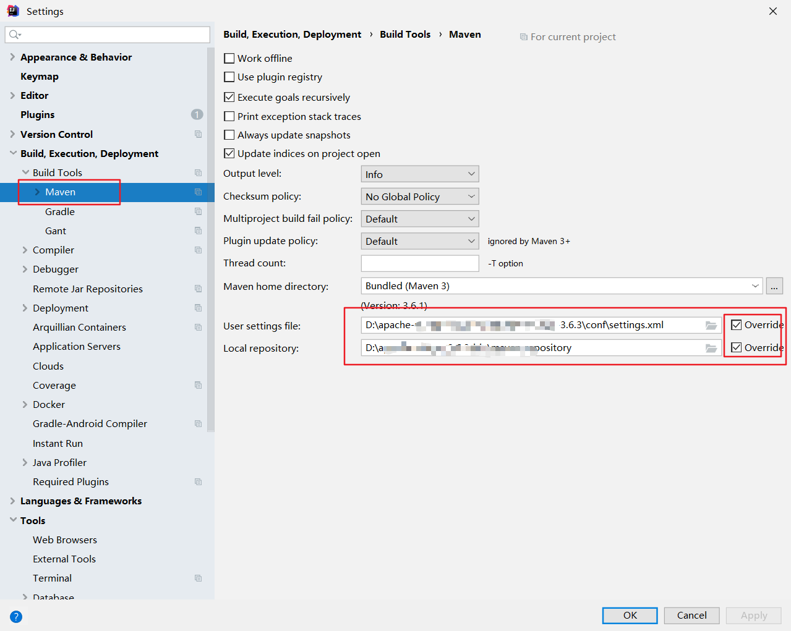

# 项目名称
&nbsp;&nbsp;&nbsp;&nbsp;socket网络编程
# 编程环境
&nbsp;&nbsp;&nbsp;&nbsp;Windows 10、IDEA、Java8、MySQL8 
&nbsp;&nbsp;&nbsp;&nbsp;本项目基于maven，使用JavaFX编写GUI界面实现所需功能
# 如何编译和运行项目
&nbsp;&nbsp;&nbsp;&nbsp;1. 首先配置Maven环境，具体过程百度 
&nbsp;&nbsp;&nbsp;&nbsp;2. 其次配置IDEA的Maven为自定义Maven 

&nbsp;&nbsp;&nbsp;&nbsp;3. 配置多个客户端 

&nbsp;&nbsp;&nbsp;&nbsp;4. 运行程序（运行多个客户端） 
# 项目结构
### enity
&nbsp;&nbsp;&nbsp;&nbsp;包含Client和Server两个实体类 

### pane
&nbsp;&nbsp;&nbsp;&nbsp;包含GUI界面的面板类 

### utils
&nbsp;&nbsp;&nbsp;&nbsp;包含数据库相关的帮组类 

### 测试目录
&nbsp;&nbsp;&nbsp;&nbsp;包含一些测试类 

# 运行结果

